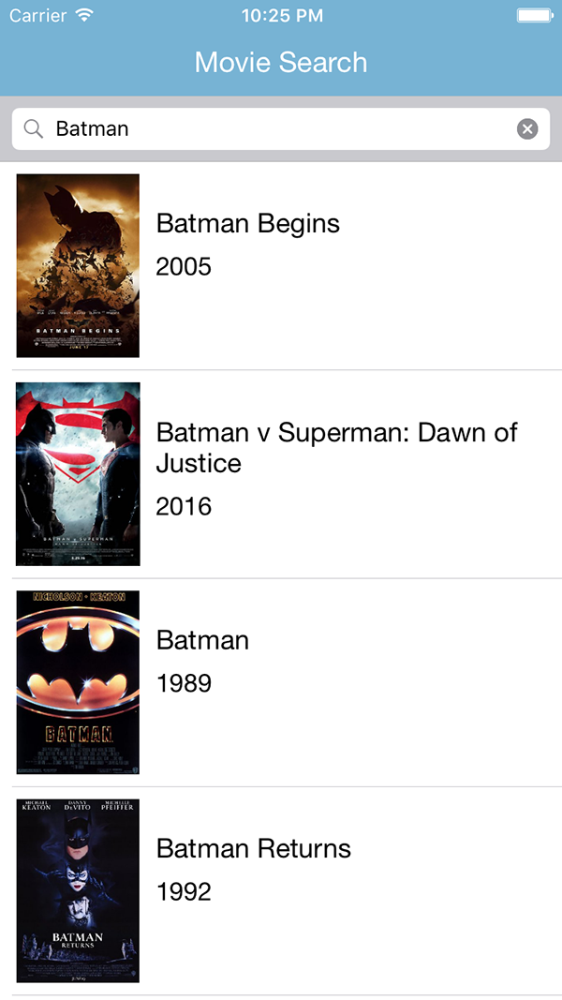
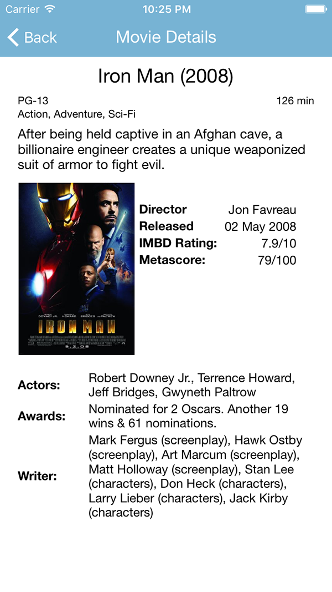

# Movie Search (iOS)
**A movie search app for iOS that uses Swift, Alamofire, ObjectMapper, Kingfisher.**  
(Android version source <a href="https://github.com/romeroz/movie-search-android">here</a>) 

  
  

##iOS technologies used: 
- Alamofire: https://github.com/Alamofire/Alamofire  
- ObjectMapper: https://github.com/Hearst-DD/ObjectMapper/  
- Kingfisher: https://github.com/onevcat/Kingfisher  

##More information:
- Utilizes the free public OMDB API: http://www.omdbapi.com